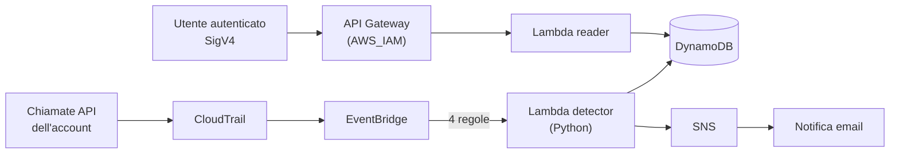
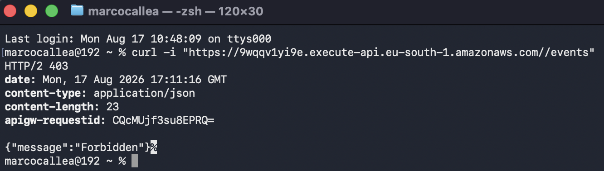
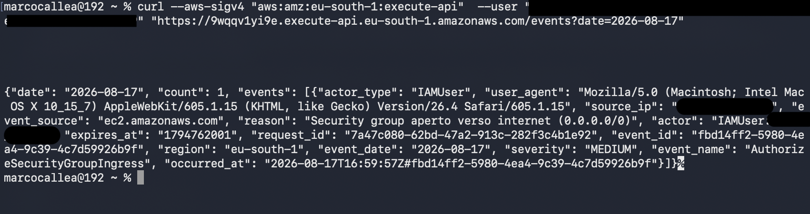

# AWS Security Watchdog

[](https://github.com/marcocallea/aws-security-watchdog/actions)

Detection serverless per un account AWS: intercetta in tempo reale gli eventi rilevanti per la sicurezza, li archivia e manda una notifica. Tutto definito in Terraform.

L'idea nasce da un problema pratico. CloudTrail registra ogni chiamata API dell'account, ma i log finiscono in un bucket S3 che nessuno legge finché non serve, cioè quando il danno è già fatto. Questo progetto chiude quel divario: quando qualcuno apre un security group verso internet, crea una chiave di accesso o prova a disattivare CloudTrail, arriva una mail entro pochi secondi.


## Architettura



Il percorso di un evento: CloudTrail registra la chiamata API, EventBridge la confronta con le regole configurate, e se corrisponde invoca la Lambda detector. La funzione classifica l'evento, lo scrive su DynamoDB e, se la severità lo giustifica, pubblica su SNS che recapita la mail. In parallelo una API Gateway autenticata espone una seconda Lambda che rilegge lo storico dalla tabella.

Nessuna VPC: le due funzioni non accedono a risorse private, quindi metterle in una sottorete aggiungerebbe cold start e un NAT gateway senza alcun beneficio.

## Struttura

```
bootstrap/          bucket S3 per lo state remoto e budget alert
envs/prod/          composizione dei moduli e backend
modules/
  cloudtrail/       trail multi-regione, bucket dei log cifrato con lifecycle
  detection/        regole EventBridge, Lambda detector, ruolo IAM
  storage/          tabella DynamoDB
  notify/           topic SNS cifrato e subscription email
  api/              API Gateway HTTP, Lambda reader, ruolo IAM
src/
  detector/         classificazione e scrittura degli eventi
  reader/           query per data sulla tabella
```

## Cosa viene monitorato

Quattro regole EventBridge, scelte perché coprono le quattro fasi tipiche di una compromissione.

**Accesso alla console.** Ogni login viene registrato. Un accesso con utente root è HIGH, un tentativo fallito è MEDIUM, un login normale resta LOW.

**Modifiche ai security group.** La regola intercetta le chiamate di autorizzazione e revoca. La Lambda distingue una modifica qualsiasi (LOW) da una che espone verso internet (MEDIUM), controllando se nei parametri della richiesta compare `0.0.0.0/0`.

**Movimenti IAM.** Creazione di utenti, chiavi di accesso, attacco di policy: sono le mosse con cui un attaccante si costruisce persistenza dentro l'account. Severità MEDIUM.

**Manomissione di CloudTrail.** `StopLogging`, `DeleteTrail`, `UpdateTrail` sono HIGH. Il punto interessante è che lo spegnimento del logging viene comunque registrato prima che il logging si fermi, quindi la notifica parte lo stesso: è l'ultimo segnale utile prima che l'account diventi cieco.

Solo gli eventi HIGH e MEDIUM generano una mail. I LOW finiscono in tabella e si consultano tramite l'API. È una scelta deliberata contro l'assuefazione agli allarmi: se ogni cosa manda una notifica, dopo tre giorni non se ne legge più nessuna.

## Verifiche

Test end-to-end: security group aperto a `0.0.0.0/0` dalla console, mail ricevuta pochi secondi dopo.

```
[MEDIUM] Security group aperto verso internet (0.0.0.0/0)

Evento:    AuthorizeSecurityGroupIngress
Servizio:  ec2.amazonaws.com
Chi:       IAMUser:xxxx_xxxx
Quando:    2026-08-17T16:59:57Z
Da IP:     195.32.xxx.xxx
Regione:   eu-south-1
```

L'API rifiuta chi non presenta una richiesta firmata:



Con firma SigV4 valida restituisce gli eventi della giornata, dal più recente:



Nel JSON si vede il formato della sort key, `2026-08-17T16:59:57Z#fbd14ff2...`: al timestamp è appeso l'event ID. CloudTrail ha precisione al secondo, quindi due eventi simultanei condividerebbero la stessa coppia di chiavi e il secondo sovrascriverebbe il primo. Appendere l'identificativo rende la chiave univoca senza rompere l'ordinamento cronologico.

## Scelte di design

**La chiave di partizione è la data.** In DynamoDB si interroga efficientemente una partizione alla volta, e la domanda ricorrente qui è "cosa è successo di recente". Con `event_date` come partizione e `occurred_at` come sort key, il reader esegue una `query` invece di uno `scan`, che sarebbe l'antipattern classico. La severità come partizione sarebbe stata l'alternativa, ma con pochi valori possibili avrebbe creato partizioni sbilanciate.

**TTL a 90 giorni.** Ogni item porta un campo `expires_at` e DynamoDB cancella da solo gli eventi scaduti, senza job di pulizia.

**Le regole filtrano per nome di evento, non per servizio.** Un pattern largo avrebbe intercettato anche le mie stesse operazioni Terraform e le chiamate interne dei servizi AWS, generando rumore continuo. La Lambda scarta comunque le operazioni di sola lettura come secondo livello di filtro.

**HTTP API invece di REST API.** Più semplice ed economica, e per un singolo endpoint di lettura le funzionalità della REST API non servono.

**Nessuna coda intermedia.** EventBridge invoca la Lambda direttamente. Con volumi maggiori o con la necessità di garantire il processamento anche in caso di errori ripetuti, la scelta corretta sarebbe SQS davanti alla funzione, con una dead letter queue.

## Sicurezza

**Due ruoli IAM separati, uno per funzione.** Il detector può solo scrivere su DynamoDB e pubblicare su SNS. Il reader può solo eseguire query. Nessuna delle due può fare quello che fa l'altra, ed entrambe le policy elencano gli ARN specifici delle risorse, mai un asterisco.

**L'API è autenticata con IAM.** L'endpoint è pubblico ma richiede una richiesta firmata SigV4: senza credenziali valide risponde 403, come da screenshot sopra.

**Il bucket dei log è chiuso e verificabile.** Blocco completo degli accessi pubblici, cifratura at rest, versioning, e validazione dei file abilitata su CloudTrail, che aggiunge un digest crittografico per rilevare manomissioni dei log.

**La bucket policy è una resource-based policy.** CloudTrail è un servizio AWS e non può assumere un ruolo, quindi il permesso di scrittura si dichiara sul bucket. Le condizioni su `aws:SourceArn` limitano l'accesso alla trail di questo account, che è la protezione contro il pattern del confused deputy.

**Il topic SNS è cifrato** con chiave gestita da AWS. Di conseguenza il detector ha bisogno anche dei permessi KMS per pubblicare.

## Security scanning

La pipeline esegue checkov su ogni push e pull request in modalità bloccante, insieme a `terraform fmt`, `validate` e tflint. Nessun job usa credenziali AWS: `validate` gira con `-backend=false`, quindi la CI non tocca l'account.

Stato attuale: 82 controlli superati, 0 falliti, 27 saltati con motivazione scritta nel codice.

Gli skip più interessanti non sono quelli di costo (WAF, access log, chiavi KMS dedicate, retention lunghe) ma quelli architetturali, cioè i controlli che non si applicano per come è fatto questo progetto. `CKV_AWS_117` chiede che le Lambda stiano in una VPC, ma qui non accedono a nulla di privato. `CKV_AWS_252` chiede che CloudTrail notifichi via SNS, ma la notifica in questo progetto passa dalla pipeline EventBridge, che è più rapida e più selettiva. `CKV2_AWS_10` chiede l'integrazione di CloudTrail con CloudWatch Logs, che sarebbe ridondante per lo stesso motivo.

## Costi

L'infrastruttura è quasi interamente pay per use e resta dentro il piano gratuito con i volumi di un account personale. Lambda e API Gateway si pagano a invocazione, DynamoDB è in modalità on demand, EventBridge non ha costi per gli eventi AWS nativi. L'unica spesa ricorrente è lo storage S3 dei log di CloudTrail, contenuta dalla lifecycle rule che li elimina dopo 30 giorni.

A differenza di un'architettura basata su container e load balancer, questa può restare accesa in permanenza senza costi significativi, che è esattamente quello che serve a un sistema di detection.

Un budget mensile con due soglie di allarme via email è configurato nel bootstrap, prima di qualsiasi altra risorsa.

## Deploy

Prerequisiti: un account AWS, Terraform 1.10 o superiore, credenziali di un utente IAM (non root).

```bash
cd bootstrap
terraform init && terraform apply

cd ../envs/prod
terraform init && terraform apply
```

Dopo l'apply arriva una mail di conferma della subscription SNS: finché non viene confermata non si ricevono notifiche. L'URL dell'API viene stampato negli output.

## Roadmap

- Deduplicazione degli eventi: al momento cento modifiche consecutive generano cento notifiche
- Dead letter queue sulla Lambda detector e gestione esplicita degli errori di scrittura
- Regole aggiuntive su S3 (bucket resi pubblici) e su KMS (chiavi programmate per la cancellazione)
- Access logging su API Gateway
- Notifica su un secondo canale oltre alla mail

Marco Callea, [marcocallea.it](https://marcocallea.it)
